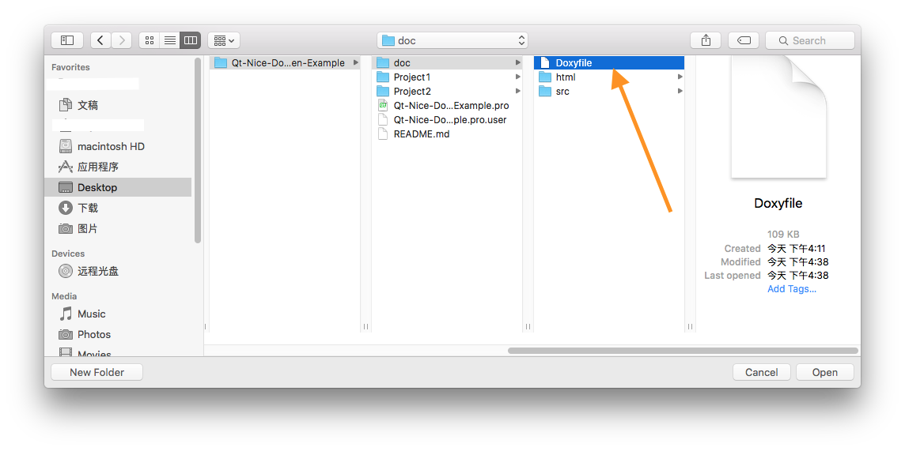
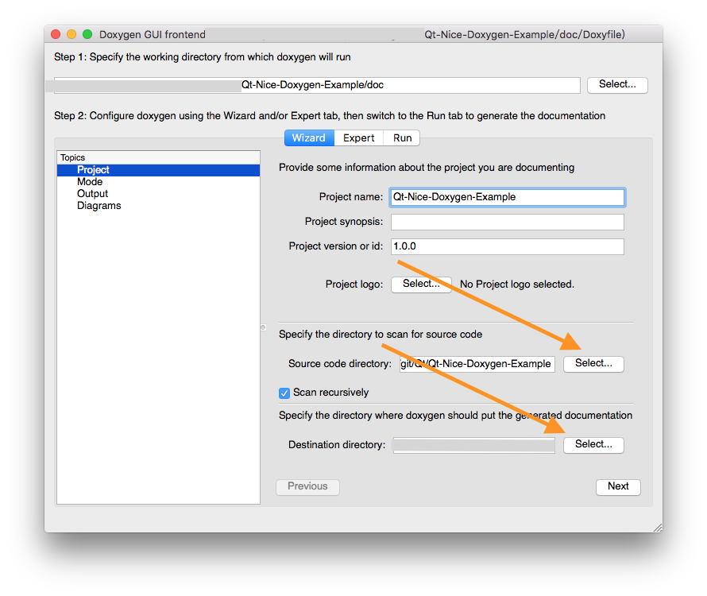
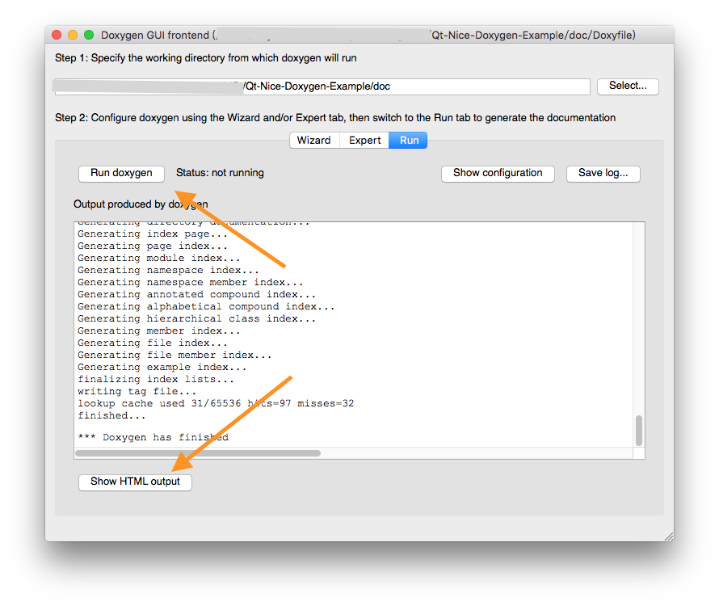

# Qt-Nice-Doxygen-Example

Qt-Nice-Doxygen-Example shows the general usage of Doxygen tool to Auto-Document Qt project.

Qt-Nice-Doxygen-Example 展示了在 Qt 项目中使用 Doxygen 工具进行自动化文档生成。

## Auto-Generated Document
[Qt-Nice-Doxygen-Example Document](https://bringer-of-light.github.io/Qt-Nice-Doxygen-Example/doc/html/index.html)

## How to use
1. Download doxygen binary distribution from [Doxygen Downloads](http://www.stack.nl/~dimitri/doxygen/download.html) and install it.
2. Download or clone this repository.
3. Run Doxygen Application, click File->open on it's main menu, open "Doxyfile" in Qt-Nice-Doxygen-Example/doc.

4. Select source code directory and destination directory. The destination directory is where the Doxygen put output document.

5. Now it's time to Run doxygen to get what we want: the output document!

6. The output document is located in Qt-Nice-Doxygen-Example/doc/html/index.html. 

